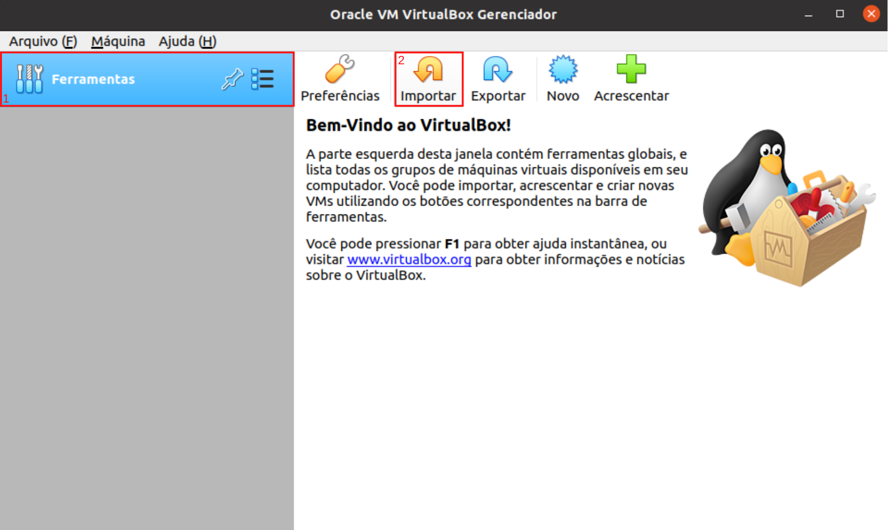

# Passo a passo - Criando rede virtual com Ubuntu Server

Neste roteiro/tutorial iremos auxiliar na criação de uma rede do tipo estrela com 8 servidores virtuais com o sistema operacional Ubuntu instalado.

-----------------------------------------------------------------------------------------------------

## Súmario

### [Abordagem geral](#abordagem-geral-1)
1. [Objetivo](#1-objetivo)
2. [Topologia](#2-topologia)
3. [Endereçamento](#3-endereçamento)

### Instalanado o Sistema
1. Baixar ISO
2. Criar Maquina virtual
3. Importar ISO
4. Instalando o sistema

### Parte virtual da rede

1. Instalar pacotes necessários
2. Acessar o arquivo netplan
3. Editar o arquivo netplan
4. Mudar adaptador de rede no VirtualBox
5. Configurar serviço de nomes estático

### Parte física da rede
1. Conectar maquinas

### Possíveis erros

----------------------------------------------------------------------------------------------------

## Abordagem geral

### 1. Objetivo 

* O objetivo principal é criar uma rede estrela com 8 VMs divididas em 4 PCs conectados por um Switch. No fim teremos 8 servidores ubuntu conectados na mesma rede e com acesso remoto um ao outro via ssh.
* Para isso tanto as VMs devem ser configuradas como as interfaces de rede dessas VMs.

#

### 2. Topologia

* A topologia utilizada na rede é do tipo estrela, nessa topologia os computadores são todos conectados a um hub (switch) central que atua conectando todas as máquinas. O hub gerencia a transmissão de dados pela rede. Ou seja, qualquer dado enviado pela rede viaja pelo hub central antes de terminar em seu destino uqe pode ser qualquer uma das máquinas conectadas ao mesmo.
* Na nossa rede todos os 4 PCs utilizados precisam estar conectados a um switch, fazendo com que as máquinas virtuais tabém possam urilizar desta conexão caso configuradas de maneira correta conforme este guia. 
* Segue imagem da topologia da rede na figura 1.

<p><center> Figura 2: Topologia de Rede estrela, com oito VMs com suas NICs em modo BRIDGE</center></p>   


# 

### 3. Endereçamento
* Para uma melhor organização aconselhamos que você organize todas as maquinas com sua descrição, o endereço IP determinado para cada uma, seu hostname, seu FQDN e também sua aliase.
* No nosso caso determinamos todos os endereços IPs da rede dentro do padrão `192.168.24.[n]`, com `n` dentro do intervalo determinado pelo professor para cada grupo, no nosso caso entre 33 e 46.
* Para o hostname utilizaremos o padrão `srv-vm[n]-pc[x]`, com `n` sendo o número da maquina virtual e `x` sendo o número do PC na rede.
* Para o FQDN utilizaremos o padrão `[nome]+[n].grupo3-924.ifalara.net`, sendo `nome` o nome do responsavel pela maquina e `n` o numero da maquina virtual.
* Para as aliases utilizaremos o primeiro e o segundo nome para as maquinas 1 e 2 de cada responsável, respectivamente.
* A tabela 1 mostra detalhadamente essas definições.

```
Tabela 1: Definições de endereços IPs da Rede e Nomes de Hosts
-----------------------------------------------------------------------------------------------------
|  DESCRICAO  |  IP             |   hostname        |               FQDN               |   aliase   |
-----------------------------------------------------------------------------------------------------
| VM1-PC1     | 192.168.24.33   |   srv-vm1-pc1     | dosons1.grupo3-924.ifalara.net   |   dosons   |
| VM2-PC1     | 192.168.24.34   |   srv-vm2-pc1     | dosons2.grupo3-924.ifalara.net   |   vitor    |
| VM1-PC2     | 192.168.24.35   |   srv-vm1-pc2     | clara1.grupo3-924.ifalara.net    |   clara    |
| VM2-PC2     | 192.168.24.36   |   srv-vm2-pc2     | clara2.grupo3-924.ifalara.net    |   cortez   |
| VM1-PC3     | 192.168.24.37   |   srv-vm1-pc3     | julia1.grupo3-924.ifalara.net    |   julia    |
| VM2-PC3     | 192.168.24.38   |   srv-vm2-pc3     | julia2.grupo3-924.ifalara.net    |   daniela  |
| VM1-PC4     | 192.168.24.39   |   srv-vm1-pc4     | veronica1.grupo3-924.ifalara.net |   veronica |
| VM2-PC4     | 192.168.24.40   |   srv-vm2-pc4     | veronica2.grupo3-924.ifalara.net |   nunes    |
-----------------------------------------------------------------------------------------------------
```
-----------------------------------------------------------------------------------------------------

## Instalando o Sistema

### 1. Baixar ISO

* O sistema escolhida para o tutorial foi o Ubuntu Live Server 22.04.1, [clique aqui](https://releases.ubuntu.com/22.04.1/ubuntu-22.04.1-live-server-amd64.iso?_ga=2.145907636.1635110145.1660307260-2090410815.1656208228) para fazer o download da ISO.
* Você pode optar por outra versão ou outro sistema, fica a seu criterio, mas fique ciente que algumas configurações podem variar adepender do Sistema operacional.

### 2. Criar Maquina Virtual

* Para criar uma máquina virtual utilizando o virtual box você deve ir em `Ferramentas > Novo`. 

<p><center> Figura 1.1: Criando Máquina virtual, passo 1</center></p>   


* Em seguida, você deve: 
  * Escolher o nome de sua VM, neste tutorial utilazaremos o padrão `VM[n]-PC[x]`, sendo `n` o número da maquina e `x` o número do pc;
  * Escolher a pasta onde salvar a VM, utilizaremos a pasta `Grupo03`;
  * Selecionar o sistema operacional, no nosso caso `Linux`;
  * Selecionar a distribuição do sistema, no nosso caso `Ubuntu (64-bit)`.

<p><center> Figura 1.2: Criando Máquina virtual, passo 2</center></p>   


* Após isso você selecionar a quantidade de mémoria RAM da máquina, recomendamos pelo menos 1GB, ou 1024MB.
<p><center> Figura 1.3: Criando Máquina virtual, passo 3</center></p>


* Após isso você selecionar a quantidade de mémoria RAM da máquina, recomendamos pelo menos 1GB (1024MB).

Figura 1.4: Criando Máquina virtual, passo 3


---------------------------------------------------------------------------------------------------------

## Parte virtual da rede 

### Importar arquivos OVA no VirtualBox

* O arquivo .OVA é um formato de exportação de VM utilizado pelo VirtualBox
* Vamos importar este arquivo para criar todas as VMs que precisamos para criar a nossa rede estrela.

* A Figura 2 Ilustra as configurações para a importação das VMs.

<p><center> Figura 2: Criando uma VM apartir de um arquivo OVA</center></p>   
    <br/>
   
   	

#

### Mudar hostname
