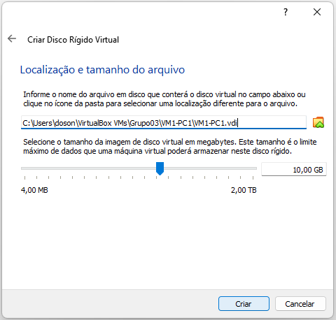

# Passo a passo - Criando rede virtual com Ubuntu Server

Neste roteiro/tutorial iremos auxiliar na criação de uma rede do tipo estrela com 8 servidores virtuais com o sistema operacional Ubuntu instalado.

-----------------------------------------------------------------------------------------------------

## Súmario

### [Abordagem geral](#abordagem-geral-1)
1. [Objetivo](#1-objetivo)
2. [Topologia](#2-topologia)
3. [Endereçamento](#3-endereçamento)

### [Instalando o Sistema](#instalando-o-sistema-1)
1. [Baixar ISO](#1-baixar-iso)
2. [Criar Maquina virtual](#2-criar-maquina-virtual)
3. [Importar ISO](#3-importar-iso)
4. [Instalação do sistema](#4-instalação-do-sistema)

### [Parte virtual da rede](#parte-virtual-da-rede-1)

1. [Instalar pacotes necessários](#1-instalar-pacotes-necessários)
2. [Configurar endereço IP e máscara da rede](#2-configurar-endereço-ip-e-máscara-da-rede)
3. [Configurar e habilitar ssh e firewall](#3-configurar-e-habilitar-ssh-e-firewall)
4. [Configurar serviço de nomes estáticos](#4-configurar-serviço-de-nomes-estáticos)
5. [Criar novos usuarios](#5-criar-novos-usuarios)
6. [Mudar adaptador de rede no VirtualBox](#6-mudar-adaptador-de-rede-no-virtualbox)

### Parte física da rede
1. Conectar maquinas

### Possíveis erros

----------------------------------------------------------------------------------------------------

## Abordagem geral

### 1. Objetivo 

* O objetivo principal é criar uma rede estrela com 8 VMs divididas em 4 PCs conectados por um Switch. No fim teremos 8 servidores ubuntu conectados na mesma rede e com acesso remoto um ao outro via ssh.
* Para isso tanto as VMs devem ser configuradas como as interfaces de rede dessas VMs.

#

### 2. Topologia

* A topologia utilizada na rede é do tipo estrela, nessa topologia os computadores são todos conectados a um hub (switch) central que atua conectando todas as máquinas. O hub gerencia a transmissão de dados pela rede. Ou seja, qualquer dado enviado pela rede viaja pelo hub central antes de terminar em seu destino uqe pode ser qualquer uma das máquinas conectadas ao mesmo.
* Na nossa rede todos os 4 PCs utilizados precisam estar conectados a um switch, fazendo com que as máquinas virtuais tabém possam urilizar desta conexão caso configuradas de maneira correta conforme este guia. 
* Segue imagem da topologia da rede na figura 1.

<p><center> Figura 1: Topologia de Rede estrela, com oito VMs com suas NICs em modo BRIDGE</center></p>   


# 

### 3. Endereçamento
* Para uma melhor organização aconselhamos que você organize todas as maquinas com sua descrição, o endereço IP determinado para cada uma, seu hostname, seu FQDN e também sua aliase.
* No nosso caso determinamos todos os endereços IPs da rede dentro do padrão `192.168.24.[n]`, com `n` dentro do intervalo determinado pelo professor para cada grupo, no nosso caso entre 33 e 46.
* Para o hostname utilizaremos o padrão `srv-vm[n]-pc[x]`, com `n` sendo o número da maquina virtual e `x` sendo o número do PC na rede.
* Para o FQDN utilizaremos o padrão `[nome]+[n].grupo3-924.ifalara.net`, sendo `nome` o nome do responsavel pela maquina e `n` o numero da maquina virtual.
* Para as aliases utilizaremos o primeiro e o segundo nome para as maquinas 1 e 2 de cada responsável, respectivamente.
* A tabela 1 mostra detalhadamente essas definições.

```
Tabela 1: Definições de endereços IPs da Rede e Nomes de Hosts
-----------------------------------------------------------------------------------------------------
|  DESCRICAO  |  IP             |   hostname        |               FQDN               |   aliase   |
-----------------------------------------------------------------------------------------------------
| VM1-PC1     | 192.168.24.33   |   srv-vm1-pc1     | dosons1.grupo3-924.ifalara.net   |   dosons   |
| VM2-PC1     | 192.168.24.34   |   srv-vm2-pc1     | dosons2.grupo3-924.ifalara.net   |   vitor    |
| VM1-PC2     | 192.168.24.35   |   srv-vm1-pc2     | clara1.grupo3-924.ifalara.net    |   clara    |
| VM2-PC2     | 192.168.24.36   |   srv-vm2-pc2     | clara2.grupo3-924.ifalara.net    |   cortez   |
| VM1-PC3     | 192.168.24.37   |   srv-vm1-pc3     | julia1.grupo3-924.ifalara.net    |   julia    |
| VM2-PC3     | 192.168.24.38   |   srv-vm2-pc3     | julia2.grupo3-924.ifalara.net    |   daniela  |
| VM1-PC4     | 192.168.24.39   |   srv-vm1-pc4     | veronica1.grupo3-924.ifalara.net |   veronica |
| VM2-PC4     | 192.168.24.40   |   srv-vm2-pc4     | veronica2.grupo3-924.ifalara.net |   nunes    |
-----------------------------------------------------------------------------------------------------
```
-----------------------------------------------------------------------------------------------------

## Instalando o Sistema

### 1. Baixar ISO

* O sistema escolhida para o tutorial foi o Ubuntu Live Server 22.04.1, [clique aqui](https://releases.ubuntu.com/22.04.1/ubuntu-22.04.1-live-server-amd64.iso?_ga=2.145907636.1635110145.1660307260-2090410815.1656208228) para fazer o download da ISO.
* Você pode optar por outra versão ou outro sistema, fica a seu critério, mas fique ciente que algumas configurações podem variar adepender do Sistema operacional.

#

### 2. Criar Maquina Virtual

* Para criar uma máquina virtual utilizando o virtual box você deve ir em `Ferramentas > Novo`. 

<p><center> Figura 2.1: Criando Máquina virtual, passo 1</center></p>   


* Em seguida, você deve: 
  * Escolher o nome de sua VM, neste tutorial utilazaremos o padrão `VM[n]-PC[x]`, sendo `n` o número da maquina e `x` o número do pc;
  * Escolher a pasta onde salvar a VM, utilizaremos a pasta `Grupo03`;
  * Selecionar o sistema operacional, no nosso caso `Linux`;
  * Selecionar a distribuição do sistema, no nosso caso `Ubuntu (64-bit)`.

<p><center> Figura 2.2: Criando Máquina virtual, passo 2</center></p>   


* Após isso você deve selecionar a quantidade de mémoria RAM da máquina, recomendamos pelo menos 1GB, ou 1024MB.
<p><center> Figura 2.3: Criando Máquina virtual, passo 3</center></p>


* Agora você deve selecionar o tipo de criação do seu disco rigido, iremos criar um novo disco do zero.
<p><center> Figura 2.4: Criando Máquina virtual, passo 4</center></p>


* Agora você deve selecionar o tipo de arquivo do seu disco rigido, utilizaremos o tipo `VDI (VirtualBox Disk Image`).
<p><center> Figura 2.5: Criando Máquina virtual, passo 5</center></p>


* Agora você escolher o tipo de armazenamento no seu disco, vamos usar o tipo `dinamicamente alocado`, nesse tipo de armazenamento o disco irá expandir e ocupar memoria no seu computador somente quando necéssario, ou seja o disco vai aumentando conforme o sistema precise.
<p><center> Figura 2.6: Criando Máquina virtual, passo 6</center></p>


* Nessa parte você deve selecionar o local do disco rigido virtual na memoria do seu computador e o tamanho dele, essa parte fica totalmente a seu criterio e no quanto você precisa.
<p><center> Figura 2.7: Criando Máquina virtual, passo 7</center></p>


* Feito isso sua máquina virtual já está pronta, mas antes de iniciar ela iremos certificar de que ela tem ao menos 2 cores em seu processador.
* Para fazer isso acesse a maquina e em seguida vá em configurações, no nosso caso `VM1-PC1 > Configurações`

<p><center> Figura 2.8: Criando Máquina virtual, passo 8</center></p>


* Então vá em `Sistema > Processador` e verifique quantos cores estão alocados para a máquina virtual, o minimo aconselhavel são 2.
<p><center> Figura 2.9: Criando Máquina virtual, passo 9</center></p>


* Pronto, sua máquina virtual está criada e pronta para a instalação do sistema operacional.

#

### 3. Importar ISO

* Antes de iniciar a instalação do sistema vamos selecionar a imagem (ISO) para instalação, para isso vá na sua máquina virtual e clique em Iniciar.
<p><center> Figura 3.1: Importando a ISO, passo 1</center></p>


* Quando a máquina iniciar escolha o arquivo baixado e em seguida clique em inciar.
<p><center> Figura 3.2: Importando a ISO, passo 2</center></p>


#

### 4. Instalação do sistema

* Quando a máquina carregar a imagem e iniciar escolha a opção `Try or install Ubuntu Server`
<p><center> Figura 4.1: Instalar SO, passo 1</center></p>


* Em seguida selecione o idioma que você deseja para o servidor
<p><center> Figura 4.2: Instalar SO, passo 2 - Escolher idioma</center></p>


* Caso esteja disponivel uma versão mai atualizada do sistema ele irá avisar na instalação e perguntar se você deseja atualizar, para o nosso caso iremos continuar a instalação a versão desatualizada mesmo.
<p><center> Figura 4.3: Instalar SO, passo 3 - Escolher versão</center></p>


* Após isso você deve selecionar o layout do teclado da sua máquina para a instalação do sistema, no nosso caso iremos utilizar o layout `Portuguese (Brazil)`
<p><center> Figura 4.4: Instalar SO, passo 4 - Escolher layout de teclado</center></p>


* Agora você precisa escolher o tipo do seu servidor, para essa prática utilizaremos o tipo `Ubuntu Server` (padrão)
<p><center> Figura 4.5: Instalar SO, passo 5 - Escolher tipo de servidor</center></p>


* Na proxima parte vc deve configurar as Ligações de rede, por enquanto pode deixar o padrão e continuar
<p><center> Figura 4.6: Instalar SO, passo 6 - Configurar Ligações de rede</center></p>


* O proximo passo é Configurar proxy, por enquanto deixaremos essa parte em branco e continuaremos com o padrão
<p><center> Figura 4.7: Instalar SO, passo 6 - Configurar proxy</center></p>


* Na tela seguinte ele irá pedir o endereço do espelho de arquivo, recomendamos deixar o padrão e continuar
<p><center> Figura 4.8: Instalar SO, passo 8 - Espelho de arquivo</center></p>


* O proximo passo é configurar o armazenamento do sistema, recomendamos também permanecer no padrão recomendado
<p><center> Figura 4.9: Instalar SO, passo 9 - Configurar armazenamento</center></p>


* Ainda nas configurações de armazenamento irá aparecer outra página para a configuração de partições, apenas mantenha o padrão e continue
<p><center> Figura 4.10: Instalar SO, passo 10 - Configurar armazenamento parte 2 </center></p>


* Quando aparecer uma mensagem de aviso alertando que está pé uma operação perigosa, apenas clique em continuar (isso ira formatar o disco selecionado, como estamos instalando um so em um novo disco rigido virtual vazio isso não fara diferença)
<p><center> Figura 4.11 Instalar SO, passo 11 - Configurar armazenamento parte 3</center></p>


* A próxima parte da instalação consiste na definição do perfil tanto do úsuario principal quanto do servidor, nessa parte você deve colocar as informações desejadas, na nossa prática iremos utilizar: `nome: administrador`, `hostname: srv-vm1-pc1`, `usuario: administrador`, `senha: adminifal`
<p><center> Figura 4.12 Instalar SO, passo 12 - Definir perfil</center></p>


* Agora chegou uma das partes principais, nessa parte você deve instalar o openssh-server, caso está opção não esteja selecionada marque-a e clique em continuar
<p><center> Figura 4.13 Instalar SO, passo 13 - Instalar SSH server</center></p>


* Na proxima tela ele irá mostrar as opções de drivers de terceiros disponiveis ou necessarios, no nosso caso não selecionamos nenhum
<p><center> Figura 4.14 Instalar SO, passo 14 - Drivers de terceiros</center></p>


* Antes da conslusão da instalação ele mostrará um conjuntop de snaps (pacotes de ferramentas) comuns entre os usúarios de servidores ubuntu, caso precise ou queira utilizar algum dele você já pode selecionar agora. No nosso caso não iremos utilizar nenhum deles (Caso venha precisar em algum momento e não o selecionou aqui não se preocupe, você poderá instalar qualquer um desses a qualquer momento no seu servidor)
<p><center> Figura 4.15 Instalar SO, passo 15 - Instalar snaps</center></p>


* Agora aguarde a instalação do sistema, quando o processo for finalizado e aparecerem as opções vá em `Cancel update and reboot` 
<p><center> Figura 4.16 Instalar SO, passo 16 - Conclusão</center></p>


* Pronto, sistema opéracional instalado e funcionando, agora você só precisa digitar seu user e sua senha para fazer login.
<p><center> Figura 4.17 Instalar SO, passo 17 - Login</center></p>


---------------------------------------------------------------------------------------------------------

## Parte virtual da rede 

### 1. Instalar pacotes necessários

Para poder dar continuidade na configuração dos servidores e da rede precisamos instalar alguns pacotes necessarios para tudo funcionar corretamente, estes são o openssh-server e o net-tools, como o openssh-server foi instalado durante a instalação do sistema operacional não precisamos voltar a faze-lo novamente.

A instalação do net-tools é simples, basta utilizar o seguinte comando:
```shell
sudo apt-get install net-tools
```
>*Lembre-se que é nécessario que a máquina esteja com uma conexão estabelecida com a internet

### 2. Configurar endereço IP e máscara da rede

Para fazer a alteração do endereço ip da sua máquina e da mascara de rede você precisa acessar o arquivo do netplan utilizando o editor nano e então mudar algumas predefinições das configurações de rede, para isso utilize o comando nano com o caminho do arquivo do netplan, para descobrir o nome do arquivo utilize o comando:

```shell
sudo ls /etc/netplan
```

No nosso caso a saida foi:

```shell
00-installer-config.yaml
```

Então, em seguida, utilizamos o seguinte comando para acessar o arquivo com o editor nano:

```shell
sudo nano /etc/netplan/00-installer-config.yaml
```

O conteúdo do arquivo será o seguinte:

```shell
# This is the network config written by 'subiquity'
network:
  ethernets:
    enp0os3:
      dhcp4: true
  version: 2
```

Para a nossa pratica funcionar e você conseguir mudar o ip e a mascara de rede com exito, você deve inserir os campos `addresses` e `gateway4` dentro de `enp0s3`, além de trocar o `dhcp4` para false, de forma que o arquivo final seja:

```shell
# This is the network config written by 'subiquity'
network:
  ethernets:
    enp0os3:
      addresses: [192.168.24.33/28]
      gateway4: 192.168.24.33
      dhcp4: false
  version: 2
```

O gateway deve ser o mesmo em todas as máquinas da redes, nesse caso utilizaremos o 192.168.24.33 por ser o primeiro endereço ip disponivel para o nosso grupo, lembrando que todas as outras máquinas da nossa redes seguira a partir do 192.168.24.33 até o 192.168.24.40.
>*Lembre-se que toda a identação do arquivo do netplan deve ser feita utilizando espaços, caso seja feito com deve isso acarretara em erros na hora da execução.

Com o arquivo pronto utilize Control+O para salvar e depois Control+X para sair

Em seguida utilize em sequencia os comandos abaixo para aplicar as configurações e mostrar elas na tela:

```shell
sudo netplan apply
ifconfig -a
```

Pronto, seu IP está devidamente configurado.


### 3. Configurar e habilitar ssh e firewall

O servirdor SSH foi instalado previamente no nosso sistema, então basta utilizar o comando:
```shell
systemctl status ssh
```
Para verificar se está tudo ok, e então dar continuidade a pratica.

O próximo passo é configurar o firewall para permitir conexões remota via protocolo SSH, para fazer isso execute os comandos abaixo:
```shell
sudo ufw allow ssh
sudo ufw enable
```

Pronto, caso queira verificar que tudo está correto utilize o comando: 
```shell
sudo ufw status
```
Para verificar o status do firewall, se tudo estiver corrido corretamente a saida será a seguinte:
```shell
Status: active
To                     Action     From
--                     ------     ----
22/tcp                 ALLOW      Anywhere
22/tcp (v6)            ALLOW      Anywhere (v6)
```

### 4. Configurar serviço de nomes estáticos

Para configurar os nomes estáticos de todas as VMs na rede, acesse o arquivo de hosts
```shell
sudo nano /etc/hosts
```

E agora, utilizando a tabela de definições de endereços IPs da Rede e Nomes de Hosts (Tabela 2), edite o arquivo de hosts

```
Tabela 2: Definições de endereços IPs da Rede e Nomes de Hosts
-----------------------------------------------------------------------------------------------------
|  DESCRICAO  |  IP             |   hostname        |               FQDN               |   aliase   |
-----------------------------------------------------------------------------------------------------
| VM1-PC1     | 192.168.24.33   |   srv-vm1-pc1     | dosons1.grupo3-924.ifalara.net   |   dosons   |
| VM2-PC1     | 192.168.24.34   |   srv-vm2-pc1     | dosons2.grupo3-924.ifalara.net   |   vitor    |
| VM1-PC2     | 192.168.24.35   |   srv-vm1-pc2     | clara1.grupo3-924.ifalara.net    |   clara    |
| VM2-PC2     | 192.168.24.36   |   srv-vm2-pc2     | clara2.grupo3-924.ifalara.net    |   cortez   |
| VM1-PC3     | 192.168.24.37   |   srv-vm1-pc3     | julia1.grupo3-924.ifalara.net    |   julia    |
| VM2-PC3     | 192.168.24.38   |   srv-vm2-pc3     | julia2.grupo3-924.ifalara.net    |   daniela  |
| VM1-PC4     | 192.168.24.39   |   srv-vm1-pc4     | veronica1.grupo3-924.ifalara.net |   veronica |
| VM2-PC4     | 192.168.24.40   |   srv-vm2-pc4     | veronica2.grupo3-924.ifalara.net |   nunes    |
-----------------------------------------------------------------------------------------------------
```

Exemplo de arquivo de hosts como deve ficar:

```shell
127.0.0.1 localhost
127.0.1.1 srv-vm1-pc1

192.168.24.33 srv-vm1-pc1 dosons1.grupo3-924.ifalara.net dosons
192.168.24.34 srv-vm2-pc1 dosons2.grupo3-924.ifalara.net vitor
192.168.24.35 srv-vm1-pc2 clara1.grupo3-924.ifalara.net clara
192.168.24.36 srv-vm2-pc2 clara2.grupo3-924.ifalara.net cortez
192.168.24.37 srv-vm1-pc3 julia1.grupo3-924.ifalara.net julia
192.168.24.38 srv-vm2-pc3 julia2.grupo3-924.ifalara.net daniela
192.168.24.39 srv-vm1-pc4 veronica1.grupo3-924.ifalara.net veronica
192.168.24.40 srv-vm2-pc4 veronica2.grupo3-924.ifalara.net nunes

# The following lines are desirable for IPv6 capable hosts
::1     ip6-localhost ip6-loopback
fe00::0 ip6-localnet
ff00::0 ip6-mcastprefix
ff02::1 ip6-allnodes
ff02::2 ip6-allroutes
```


### 5. Criar novos usuarios

O próximo passo da prática é realizar a criação de 4 novos usuarios no servidor, para isso usaremos as informações de todos os integrantes do grupo como consta a tabela 3.

```
Tabela 3: Novos usuarios
-----------------------------------------------------------------
|  USUARIO  |            NOME COMPLETO            | ROOM NUMBER |
-----------------------------------------------------------------
| dosons    | Dosons de Oliveira Vitor            | 924         |
| julia     | Julia Daniela Rocha de Oliveira     | 924         |
| clara     | Maria Clara Cortez Cavalcante Rocha | 924         |
| veronica  | Maria Veronica Nunes da Silva       | 924         |
-----------------------------------------------------------------
```

Para criar os usuarios utilize o comando:
```shell
sudo adduser <usuario>
```

Repita o processo para todos os usuarios desejados em todos os servidores da rede.

### 6. Mudar adaptador de rede no VirtualBox

Agora, para finalizar a parte virtual da sua rede de servidores ubuntu, você precisa desligar a sua maquina (pode fazer isso utilizando a opção de fechar aba do virtual box ou com o comando `sudo poweroff`), e em seguida ir nas configurações da sua VM. Para fazer isso acesse a tela inicial do VirtualBox e vá na sua máquina>configurações, como mostra a figura 5.1

<p><center> Figura 5.1: ALterando configurações de adaptadores, passo 1</center></p>   


Após isso, vá nas opções de rede

<p><center> Figura 5.2: ALterando configurações de adaptadores, passo 2</center></p>   


Agora, em vonfigurações de rede, clique no campo `Conectado a:` e escolha a opção `Placa em modo Bridge` e clique em ok.

<p><center> Figura 5.3: ALterando configurações de adaptadores, passo 3</center></p>   


---------------------------------------------------------------------------------------------------------

## Parte fisica da rede

### 1. Conectar maquinas

Para finalizar a rede e então poder ter acesso a todas as máquinas criadas você precisara conectar todos os computadores com um cabo ethernet (figura 6.1 e figura 6.2).

<p><center> Figura 6.1: Cabo ethernet</center></p>   


<p><center> Figura 6.2: Cabo conectado a o computador</center></p>   


Após isso, utilize um swift para fazer a conexão de todos os cabos conectados a computadores na rede, na nossa prática utilizaremos um swift de 8 portas (figura 6.3 e figura 6.4)

<p><center> Figura 6.3: Swift de 8 portas</center></p>   


<p><center> Figura 6.4: Cabos conectados a o swift</center></p>   


---------------------------------------------------------------------------------------------------------
